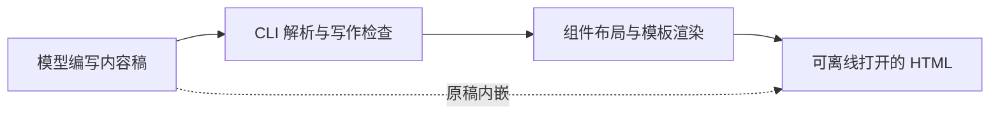

# Answer me with HTML 借鉴评估

评估日期：2026-10-03。来源：[QingYunA/answer-me-with-html](https://github.com/QingYunA/answer-me-with-html/tree/5a0e28ba4d1316de040ee24e9b729c4bdc5f5445)，版本快照为 `5a0e28b`。

本文记录该项目对 Gungnir 的参考价值，并给出输出约定建议。本次仅补充文档，不引入渲染器、依赖或新技能。性能数据来自作者，未在本项目复现。

## 结论

优先借鉴四项原则：按问题选择表达形式、先给结论、一个区块回答一个问题、保留可修改的源稿。

目标是降低用户理解、验证和决策的成本。短句、图表和页面都服务于这个目标。简化表达时，保留必要条件、例外和事实来源。

Gungnir 继续遵守[仅手动调用规则](./invocation.md)。选择表达形式不构成自动调用其他技能的授权。

## 项目如何实现

模型编写扩展 Markdown。CLI 解析稿件、检查文字，再生成包含样式和图形的单文件 HTML。布局和图形坐标由程序计算，模型不必每次重写它们。见[技能规则](https://github.com/QingYunA/answer-me-with-html/blob/5a0e28ba4d1316de040ee24e9b729c4bdc5f5445/skills/answer-me-with-html/SKILL.md)和[渲染代码](https://github.com/QingYunA/answer-me-with-html/blob/5a0e28ba4d1316de040ee24e9b729c4bdc5f5445/src/render.js)。

## 借鉴清单

| 做法 | Gungnir 的使用建议 |
| --- | --- |
| 按信息类型选择组件 | 先判断用户需要理解什么，再选文字、表格或图示。不要按固定数量凑图。 |
| 结论优先 | 开头给核心答案，后续区块说明依据、条件和限制。 |
| 每个面板回答一个问题 | 页面较长时，按用户的子问题拆分。图示展示关系，正文补充解释，避免重复。 |
| 内容与排版分开 | 经常生成同类页面时复用已有模板。确有重复成本后，再考虑通用渲染器。 |
| 页面内嵌源稿 | 需要分享或持续修改时，保留 Markdown 或其他可编辑源文件。保留源稿不能代替事实引用。 |
| 错误说明具体位置和改法 | 工具报错应指出行号、组件和修正示例，便于局部修复。 |
| 写作检查默认提示 | 检查长句、重复和空泛用语。最终仍由语义判断决定是否修改。 |

上游的[渲染实现](https://github.com/QingYunA/answer-me-with-html/blob/5a0e28ba4d1316de040ee24e9b729c4bdc5f5445/src/render.js)保留源稿，并返回结构化错误；[写作检查](https://github.com/QingYunA/answer-me-with-html/blob/5a0e28ba4d1316de040ee24e9b729c4bdc5f5445/src/lint/ste.js)主要依据词表、正则和长度阈值。

## 输出形式选择

以下是面向 Gungnir 的建议，不是上游的完整规则。使用能帮助用户完成理解和验收的最简单形式。

| 用户需要理解的内容 | 优先形式 |
| --- | --- |
| 单个事实、操作命令或简短结论 | 直接文字或代码块 |
| 多个方案在相同维度上的差异 | 表格 |
| 模块关系、依赖或分支流程 | 流程图 |
| 多个参与者按时间交换信息 | 时序图 |
| 多个相关问题，需要总览或分享 | 分区的单文件 HTML |
| 参数变化、状态迁移或操作结果 | 有反馈的交互式 HTML |
| 连续变化过程，需要画面与旁白配合 | 讲解视频；仅在比静态表达更有帮助时使用 |

例如，“本次是否提交了依赖”用结论和文件范围即可说明；“源码、构建依赖和安装包如何关联”适合用关系图；“修改缓存策略后行为如何变化”才需要交互演示。

## 不直接采用的部分

- **自动触发和高频模式**：上游允许代理按内容自动调用，还支持每次给出结论就附页面。Gungnir 保留手动调用，不为短回答强制生成额外产物。
- **固定面板数量**：不为了满足数量要求增加区块。达到理解和验收目的后停止。
- **中文句长硬门槛**：上游将步骤设为 35 字、描述设为 45 字。这些阈值只适合作为提醒，不能据此删掉必要条件，也不能证明符合完整的 ASD-STE100 标准。
- **把规则检查当成语义验证**：词表和正则不能验证事实、推理和术语含义。代码、命令、路径和原文引用不能因风格检查被随意改写。
- **用解释页替代交互原型**：上游内置页面交互主要包括主题、明暗模式和复制源稿。参数探索和状态模拟仍需专门实现。见[页面交互代码](https://github.com/QingYunA/answer-me-with-html/blob/5a0e28ba4d1316de040ee24e9b729c4bdc5f5445/src/runtime/page.js)。

## 性能证据及限制

作者在 2026-10-02 报告了 3 个主题的测试，每种方式各运行 3 次。下表沿用作者汇总的结果，比较的是两种 HTML 生成方式。见[基准说明](https://github.com/QingYunA/answer-me-with-html/blob/5a0e28ba4d1316de040ee24e9b729c4bdc5f5445/bench/README.md)和[原始结果](https://github.com/QingYunA/answer-me-with-html/blob/5a0e28ba4d1316de040ee24e9b729c4bdc5f5445/bench/results/results.json)。

| 指标 | 模型直接生成 HTML | 模型写稿后由 CLI 渲染 |
| --- | ---: | ---: |
| 输出 Token | 6,873 | 923 |
| 耗时 | 46 秒 | 13 秒 |
| 单次费用 | 0.22 美元 | 0.26 美元 |

这组结果显示输出 Token 和耗时下降，单次费用没有下降。作者将费用变化归因于额外工具轮次和上下文读取；该解释未在 Gungnir 中独立验证。

两边页面的篇幅和内容组织不同。样本较少，不能直接推算 Gungnir 的收益，也不能据此认定 HTML 比简短文字回答更省。

## 安装与维护成本

上游将 Markdown 解析、图布局、样式和页面脚本提前打包进 CLI。安装技能后无需再运行 `npm install`，但源码开发仍依赖 `marked`、`@dagrejs/dagre` 和构建工具。见[构建脚本](https://github.com/QingYunA/answer-me-with-html/blob/5a0e28ba4d1316de040ee24e9b729c4bdc5f5445/scripts/build.mjs)和[依赖声明](https://github.com/QingYunA/answer-me-with-html/blob/5a0e28ba4d1316de040ee24e9b729c4bdc5f5445/package.json)。

Gungnir 已有[完整插件打包流程](../README.md#skills--canvas-完整插件)。后续安装应优先使用与目标版本一致的预构建包。需要重新构建时，应说明开发依赖、构建产物和安装包的不同用途及本地占用。

构建依赖和缓存不纳入源码提交。安装包继续按现有发布流程生成，不因本文改变打包范围。

## 最小落地建议

先使用现有输出能力落实上述表达原则，无需统一改写全部技能。涉及教学时参考 [teach](../skills/productivity/teach/SKILL.md)，涉及状态验证时参考 [prototype](../skills/engineering/prototype/SKILL.md)；实际调用仍需用户明确指定。

本次只保存评估，并在 README 提供入口。暂不新增技能、渲染器、自动钩子或写作检查脚本。只有同类输出反复出现、现有能力不足时，再单独评估实现成本与收益。
