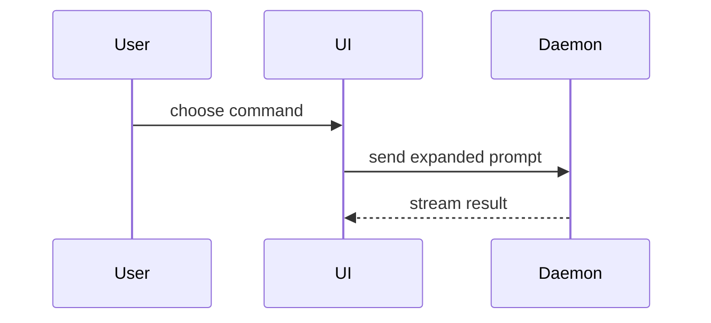

使用以下模板编写 PR 正文：

```markdown
## Summary

<diagram, diff-sketch, or tree>

## Evidence

- **Before:** <screenshot/output/failing test run>
  **After:** <screenshot/output/passing test run>

## Merge Danger

**Door:** <one-way or two-way>

<optional: description>

**Blast Radius:** <one-word description>

<optional: potential ramifications of merge>
```

## 章节

省略所有开场白，保持文字简短。使用 `GLOSSARY.md` 中用户的领域用语。

### Summary

选择能说明关键点的最小视图。

- 用伪代码展示逻辑或算法：

```text
on(save)
  if content is unchanged
    return cached result
  write new content
  return fresh result
```

- 用调用树展示运行时控制流：

```text
submitForm
  createSession
    persistPrompt
    launchAgent
  navigateToSession
```

- 用组件树展示 UI 结构，包括重要的状态和模块边界：

```text
<SessionPage> (apps/example/src/routes/session.tsx)
  useSessionEvents()
  <SessionToolbar>
    <RunSkillButton> (packages/ui)
```

- 用浅层文件树展示文件职责或大范围重构：

```text
src/
├── commands/       # parses user actions
├── sessions/       # owns session state
└── transport/      # sends API requests
```

- 用 Mermaid 展示组件交互、控制流或数据流：



- 若重点在于变化，且周围结构已存在，使用 `diff`。让 diff 的形式符合主题。

组件变更示例：

```diff
 <SessionPage>
   useSessionEvents()
   <SessionToolbar>
+    <RunSkillButton />
   <SessionTimeline>
+    <SkillResultCard />
```

文件布局变更示例：

```diff
 src/
 ├── commands/
+│   └── show-me.ts       # expands the slash command
 ├── sessions/
-└── transport.ts
+└── transport/
+    ├── client.ts
+    └── stream.ts
```

调用树或调用栈变更示例：

```diff
 submitForm
   createSession
     persistPrompt
+    expandSkillMention
     launchAgent
-  navigateToSession
+  navigateToSession
+    subscribeToEvents
```

状态或控制流变更示例：

```diff
 on(save)
-  write content
+  if content is unchanged
+    return cached result
+  write new content
+  invalidate cache
```

- 若大部分内容是新增的、省略上下文会隐藏归属或顺序，或用户需要可复制的目标结构，展示完整代码块：

```ts
function expandSkill(command: string): string {
  const skillName = command.slice(1);
  return `use the ${skillName} skill`;
}
```

#### 指引

将每个图示放在它支持的简短文字旁边。只保留回答用户当前问题，或解决当前讨论所需选项涉及的调用、文件、props、状态和边界。

可以用一种，也可以用几种，通常无需全部使用。根据实际需要判断，不要让用户应接不暇。

### Evidence

提供变更有效的具体证据，展示修改前后对比。

若环境支持截图，且变更涉及视觉效果，截图是 S 级证据。

执行结果是 A 级证据，例如测试结果、控制台输出。用伪代码展示同一个测试失败和通过的情况。

### Merge Danger

说明变更是单向门还是双向门。双向门可以返回，单向门不能。回滚成本低的 PR 风险较低。涉及破坏性操作或难以撤销的决策的变更属于单向门。

影响范围是此 PR 引入的变更可能造成的影响或波及范围。考虑各种可能，例如布局偏移、使用方功能受损、移动端响应式表现等。
